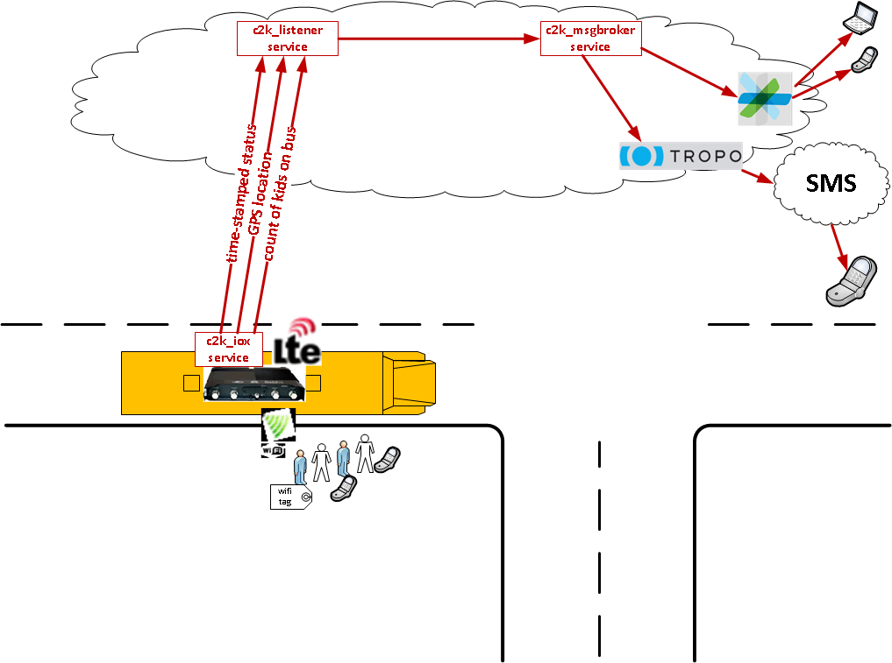

# Cisco Kiddie Kounter (C2K)

Cisco Kiddie Kounter (C2K) is a sample demonstration application that illustrates how several technologies from Cisco can be brought together to address a business problem.  

## Demo Application Background
The initial problem to be solved is to to count the kids on the school bus.  Additional capabilities include tracking school bus location and notifying school administrators and parents.  No more kids left sleeping on the bus!

## Other Demo Repositories
This repository and README provide overall details on the Demonstration application and how to deploy the full demonstration.

The following repositories are where the actual code for the different involved micro-services/components are located. 

* [c2k_demo](https://github.com/imapex/c2k_demo) - Full Demo Application Setup and Details
* [c2k_iox](https://github.com/imapex/c2k_iox) - Details on the Cisco IOx Client Application
* [c2k_listener](https://github.com/imapex/c2k_listener) - Centralized services for receiving bus updates from IoX and maintaining database
* [c2k_msg](https://github.com/imapex/c2k_msg) - Messaging services via Cisco Spark or Tropo

## Demo Setup Steps
Within the C2K Demonstration there are three application components that you will need to deploy.

### Bus Status Reporting
This component tracks bus activity, bus location via GPS, and the count of kids on the bus via WiFi mac address tracking from a WiFi-enabled mobile device or WiFi tag *(disclaimer: not all of these features enabled in the current release but are on the roadmap)*

* Cisco IoX Router - *Required*  
	* Provide internet connectivity and network access on the bus (can be staged anywhere for demo)
	* Host the status monitoring and reporting PaaS application

### Listener Services
This component receives status updates from all buses and maintains activity, location, and count state for each bus.  It also references centralized student data that associates WiFi MAC addresses reported from the buses to student names, allowing for specialized notification *(disclaimer: not all of these features enabled in the current release but are on the roadmap)*

### Message Broker Services
This component enables notification to individuals (school administrators, parents, etc) via Cisco Spark or SMS via Cisco Tropo *(disclaimer: not all of these features enabled in the current release but are on the roadmap)*

### Setup Instructions
1. Setup and deploy [c2k_listener](https://github.com/imapex/c2k_listener)
2. Setup and deploy [c2k_msg](https://github.com/imapex/c2k_msg)
3. Setup and deploy [c2k_iox](https://github.com/imapex/c2k_iox)

